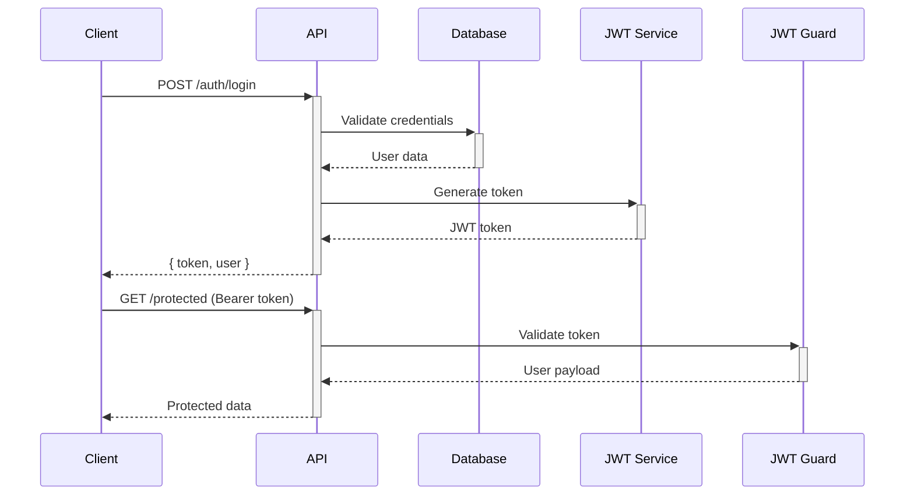
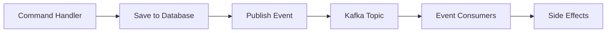

# 🏗️ Architecture Documentation

This document provides an in-depth explanation of the architectural patterns, design principles, and technical decisions used in this NestJS enterprise application.

## 📐 Architectural Overview

This application follows **Clean Architecture** principles combined with **Domain-Driven Design (DDD)** and **CQRS (Command Query Responsibility Segregation)** patterns to create a maintainable, scalable, and testable enterprise application.

## 🎯 Core Design Principles

### 1. Separation of Concerns
Each layer has a single responsibility:
- **Presentation**: Handle HTTP requests/responses
- **Application**: Orchestrate business workflows
- **Domain**: Contain business logic and rules
- **Infrastructure**: Handle external concerns

### 2. Dependency Inversion
Dependencies flow inward toward the domain:
```
Infrastructure → Application → Domain
Presentation → Application → Domain
```

### 3. Interface Segregation
Small, focused interfaces prevent tight coupling:
```typescript
interface UserRepository {
  save(user: User): Promise<void>;
  findById(id: string): Promise<User | null>;
}
```

## 🏢 Clean Architecture Layers

### Domain Layer (`domain/`)
The core of the application containing business logic.

**Components:**
- **Entities**: Core business objects
- **Value Objects**: Immutable objects with business meaning
- **Repository Interfaces**: Contracts for data access
- **Domain Services**: Business logic that doesn't fit in entities

**Example Entity:**
```typescript
export class User {
  constructor(
    public readonly id: string,
    public readonly email: string,
    private readonly passwordHash: string,
    public firstName?: string,
    public lastName?: string,
  ) {}

  static create(id: string, email: string, passwordHash: string): User {
    // Business validation
    if (!email.includes('@')) {
      throw new Error('Invalid email format');
    }
    return new User(id, email, passwordHash);
  }

  updateProfile(firstName: string, lastName: string): User {
    // Business rules for profile updates
    return new User(this.id, this.email, this.passwordHash, firstName, lastName);
  }
}
```

### Application Layer (`application/`)
Orchestrates business workflows using CQRS pattern.

**Components:**
- **Commands**: Write operations (create, update, delete)
- **Queries**: Read operations (get, list, search)
- **Handlers**: Execute commands and queries
- **DTOs**: Data transfer between layers

**Command Handler Example:**
```typescript
@CommandHandler(CreateUserCommand)
export class CreateUserHandler implements ICommandHandler<CreateUserCommand> {
  constructor(
    @Inject(USER_REPOSITORY) private repo: UserRepository,
    private producer: UserKafkaProducer,
  ) {}

  async execute(cmd: CreateUserCommand): Promise<UserCreatedResult> {
    // 1. Business logic
    const hashedPassword = await bcrypt.hash(cmd.data.password, 10);
    const user = User.create(randomUUID(), cmd.data.email, hashedPassword);
    
    // 2. Persistence
    await this.repo.save(user);
    
    // 3. Side effects
    await this.producer.publishUserCreated(user);
    
    return { id: user.id, email: user.email };
  }
}
```

### Infrastructure Layer (`infrastructure/`)
Handles external concerns and implements domain interfaces.

**Components:**
- **Database Repositories**: Prisma implementations
- **Event Publishers**: Kafka producers
- **External Services**: Third-party integrations
- **Configuration**: Environment setup

**Repository Implementation:**
```typescript
@Injectable()
export class PrismaUserRepository implements UserRepository {
  constructor(private prisma: PrismaService) {}

  async save(user: User): Promise<void> {
    await this.prisma.user.create({
      data: {
        id: user.id,
        email: user.email,
        passwordHash: user.passwordHash,
        firstName: user.firstName,
        lastName: user.lastName,
      },
    });
  }

  async findById(id: string): Promise<User | null> {
    const userData = await this.prisma.user.findUnique({ where: { id } });
    if (!userData) return null;
    
    return new User(
      userData.id,
      userData.email,
      userData.passwordHash,
      userData.firstName,
      userData.lastName,
    );
  }
}
```

### Presentation Layer (`presentation/`)
Handles HTTP requests and responses.

**Components:**
- **Controllers**: REST API endpoints
- **DTOs**: Request/response validation
- **Guards**: Authentication/authorization
- **Interceptors**: Cross-cutting concerns

## 🔄 CQRS Pattern Implementation

### Why CQRS?
- **Scalability**: Separate read/write models
- **Performance**: Optimized queries
- **Complexity Management**: Clear command/query separation
- **Event Sourcing Ready**: Natural fit for event-driven systems

### Command Side (Write Operations)
```typescript
// Command
export class CreateUserCommand {
  constructor(public readonly data: CreateUserDto) {}
}

// Handler
@CommandHandler(CreateUserCommand)
export class CreateUserHandler {
  async execute(command: CreateUserCommand): Promise<any> {
    // Validate business rules
    // Save to database
    // Publish events
  }
}

// Controller
@Post()
async create(@Body() dto: CreateUserDto) {
  return this.commandBus.execute(new CreateUserCommand(dto));
}
```

### Query Side (Read Operations)
```typescript
// Query
export class GetUserQuery {
  constructor(public readonly id: string) {}
}

// Handler
@QueryHandler(GetUserQuery)
export class GetUserHandler {
  async execute(query: GetUserQuery): Promise<UserResponseDto> {
    // Optimized read operations
    // Return DTOs
  }
}

// Controller
@Get(':id')
async findOne(@Param('id') id: string) {
  return this.queryBus.execute(new GetUserQuery(id));
}
```

## 🏢 Multi-Tenancy Architecture

### Tenant Isolation Strategy
We use **Row-Level Security** with tenant-aware repositories:

```typescript
@Injectable()
export class TenantAwarePrismaUserRepository implements UserRepository {
  async findByTenant(tenantId: string): Promise<User[]> {
    const users = await this.prisma.user.findMany({
      where: { tenantId }, // Automatic tenant filtering
    });
    return users.map(this.toDomainUser);
  }
}
```

### Tenant Resolution
Multiple strategies for tenant identification:

```typescript
@Injectable()
export class TenantService {
  resolveTenant(request: Request): string {
    // Strategy 1: Subdomain
    const subdomain = this.extractSubdomain(request);
    if (subdomain) return this.getTenantBySubdomain(subdomain);
    
    // Strategy 2: Header
    const tenantHeader = request.headers['x-tenant-id'];
    if (tenantHeader) return tenantHeader as string;
    
    // Strategy 3: JWT Claim
    const user = request.user as JwtPayload;
    return user?.tenantId;
  }
}
```

## 🔐 Security Architecture

### Authentication Flow


### Authorization Layers
1. **JWT Authentication**: Verify token validity
2. **Tenant Isolation**: Ensure data segregation
3. **Role-Based Access**: Check user permissions
4. **Resource Ownership**: Validate user owns resource

```typescript
@UseGuards(JwtAuthGuard, TenantGuard)
@Roles('admin', 'manager')
@Get()
async getUsers(
  @CurrentUser() user: JwtPayload,
  @CurrentTenant() tenantId: string,
) {
  return this.queryBus.execute(new GetUsersQuery(tenantId, user.roles));
}
```

## 📡 Event-Driven Architecture

### Event Flow


### Event Publisher Pattern
```typescript
@Injectable()
export class UserKafkaProducer {
  constructor(private kafka: KafkaService) {}

  async publishUserCreated(user: User): Promise<void> {
    await this.kafka.send({
      topic: 'user.events',
      messages: [{
        key: user.id,
        value: JSON.stringify({
          eventType: 'UserCreated',
          userId: user.id,
          tenantId: user.tenantId,
          timestamp: new Date().toISOString(),
        }),
      }],
    });
  }
}
```

## 🗄️ Data Access Patterns

### Repository Pattern
Abstract data access behind interfaces:

```typescript
// Domain Interface
export interface UserRepository {
  save(user: User): Promise<void>;
  findById(id: string): Promise<User | null>;
  findByEmail(email: string, tenantId: string): Promise<User | null>;
}

// Infrastructure Implementation
@Injectable()
export class PrismaUserRepository implements UserRepository {
  // Implementation details hidden from domain
}
```

### Unit of Work Pattern
```typescript
@Injectable()
export class UnitOfWork {
  constructor(private prisma: PrismaService) {}

  async transaction<T>(operation: () => Promise<T>): Promise<T> {
    return this.prisma.$transaction(async (tx) => {
      // All operations use the same transaction
      return operation();
    });
  }
}
```

## 🎛️ Cross-Cutting Concerns

### Logging Architecture
Structured logging with correlation IDs:

```typescript
@Injectable()
export class LoggerService {
  log(message: string, context?: Record<string, any>): void {
    const logEntry = {
      timestamp: new Date().toISOString(),
      level: 'info',
      message,
      correlationId: this.getCorrelationId(),
      ...context,
    };
    console.log(JSON.stringify(logEntry));
  }
}
```

### Error Handling Strategy
Global exception handling with proper HTTP status codes:

```typescript
@Catch()
export class AllExceptionsFilter implements ExceptionFilter {
  catch(exception: unknown, host: ArgumentsHost) {
    const ctx = host.switchToHttp();
    const response = ctx.getResponse<Response>();
    
    const status = this.getHttpStatus(exception);
    const message = this.getErrorMessage(exception);
    
    response.status(status).json({
      statusCode: status,
      message,
      timestamp: new Date().toISOString(),
    });
  }
}
```

### Validation Pipeline
Multi-layer validation approach:

1. **DTO Validation**: Input format validation
2. **Business Validation**: Domain rules
3. **Database Constraints**: Data integrity

```typescript
export class CreateUserDto {
  @IsEmail()
  @IsNotEmpty()
  email: string;

  @MinLength(6)
  @IsNotEmpty()
  password: string;
}
```

## 🚀 Scalability Considerations

### Horizontal Scaling
- **Stateless Design**: No server-side sessions
- **Database Connection Pooling**: Efficient resource usage
- **Event-Driven Communication**: Loose coupling

### Performance Optimization
- **Query Optimization**: Separate read models
- **Caching Strategy**: Redis for frequent data
- **Connection Pooling**: Database efficiency

### Monitoring & Observability
- **Health Checks**: Application and dependency status
- **Metrics Collection**: Performance indicators
- **Distributed Tracing**: Request flow tracking

## 🔧 Development Experience

### Code Generation
Automated module scaffolding:

```bash
npm run generate:module orders
# Creates complete module structure with:
# - Controllers, DTOs, Handlers
# - Domain entities and repositories
# - Infrastructure implementations
# - Test files
```

### Type Safety
Full TypeScript coverage:
- **Compile-time Validation**: Catch errors early
- **IDE Support**: Better developer experience
- **Refactoring Safety**: Confident code changes

## 🎯 Best Practices Implemented

1. **Single Responsibility**: Each class has one reason to change
2. **Open/Closed**: Open for extension, closed for modification
3. **Liskov Substitution**: Subtypes are substitutable
4. **Interface Segregation**: Many specific interfaces
5. **Dependency Inversion**: Depend on abstractions

## 📊 Architecture Metrics

- **Cyclomatic Complexity**: < 10 per method
- **Test Coverage**: > 80%
- **Dependency Depth**: < 4 levels
- **Module Coupling**: Low coupling, high cohesion

---

This architecture provides a solid foundation for building scalable, maintainable enterprise applications while following industry best practices and design patterns.